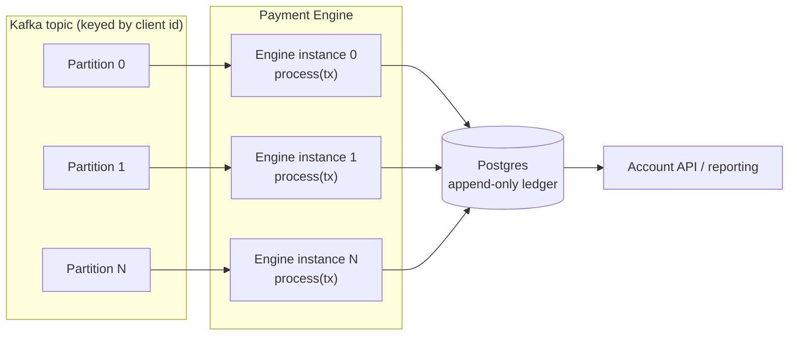

# Payment Engine

## Overview

A single-threaded toy payments engine. It streams a CSV of transactions
(deposits, withdrawals, disputes, resolves, chargebacks) in chronological
order, applies them to per-client accounts, and prints the final account
states as CSV.

## Quick start

```sh
cargo run -- transactions.csv > accounts.csv
cargo test
cargo doc --open   # rendered API docs (module and function contracts)
```

Stdout carries only the output CSV (`client,available,held,total,locked`).
Everything else — malformed rows, rejected transactions — is logged to stderr
and skipped; the run always produces output unless the input file itself
cannot be opened.

## Design

```
main.rs          CLI edge: open file, wire pipeline, log rejections to stderr
  io::process_csv    streaming reader (csv + serde), row -> Transaction conversion
    engine::process  pure business rules: Result<(), TxError> per transaction
      store          two HashMaps behind intention-revealing methods
  io::write_accounts iterate accounts, compute total, write CSV
```

- `model` — domain types: `Transaction`, `Account`, `DepositRecord`, `TxError`.
- `store` — `Store { accounts, deposits }`; a dumb container, no business rules.
- `engine` — all rules live here. `process` performs no I/O and never mutates
  state on any `Err` path; every rejection is a typed `TxError` variant.
- `io` — the parse boundary (validation, 4-decimal rounding) and the writer.
  `total` is computed at write time (`available + held`), never stored, so it
  cannot drift.

## Assumptions

- **Disputes reference deposits only.** Withdrawals are not retained, so a
  dispute naming a withdrawal's tx id is ignored as unknown. The spec's
  dispute math (available down, held up) only makes sense for deposits;
  applying it to a withdrawal would punish the client twice.
- **Available may go negative.** Deposit, withdraw, then dispute the deposit:
  the negative available is the client's debt in the fraud scenario. Held
  never goes negative.
- **Locked blocks only new deposits and withdrawals.** Disputes, resolves and
  chargebacks on pre-existing transactions still process — a frozen account
  can still receive chargebacks.
- **A chargeback is terminal** for that deposit. A resolved dispute, however,
  can be disputed again.
- **Ghost clients appear in the output.** Any well-formed deposit/withdrawal
  row creates the account, even if the operation is then rejected.
- **Duplicate deposit tx ids: first wins**; the duplicate is rejected.
  Withdrawal tx ids are trusted to be unique per the spec and are not
  tracked — a hypothetical duplicate would still be balance-checked and
  cannot overdraw.
- **Tx ids are unique among deposits/withdrawals only**; dispute-family rows
  reference an existing tx id rather than carrying their own.
- **Amounts are rounded to 4 decimal places at ingest**; zero and negative
  amounts are rejected. Type strings are matched case-insensitively.
- **Output row order is unspecified** (HashMap iteration order); tests compare
  order-insensitively.

## Correctness & testing

62 tests, written test-first:

- **Unit tests** cover every cell of the engine's rules table: each happy path
  and each rejection, asserting the exact `TxError` and that state is
  untouched on rejection.
- **Integration tests** run real CSV fixtures (`tests/fixtures/`) through the
  full pipeline — the same code path the binary ships — and compare final
  accounts order-insensitively. Scenarios include the spec example, the fraud
  flow, dispute → resolve → re-dispute → chargeback, whitespace-heavy input,
  malformed rows, locked-account behavior, and one file exercising every
  ignore rule end-to-end.

## Performance & scalability

- The input is **streamed** — the file is never loaded into memory.
- Memory is **O(#clients + #deposits)**: only deposits are retained, because
  they are the only disputable entity. Records are small (id, amount, state),
  and the u32 id space bounds the transaction universe.
- Output is a single pass over the accounts map through a buffered writer.

## From toy to production

Three deliberate gaps separate this toy from a production system:

1. **Volatile state** — accounts live in a HashMap; if the process dies, the
   state dies with it.
2. **Single-threaded by assumption** — correctness leans on the input being
   one chronologically ordered sequence; there is no concurrency anywhere.
3. **No history** — balances are mutated in place, so there is no trail to
   audit or reconcile against, which is untenable in a domain that exists
   because of disputes.

### Durable storage

State moves to Postgres. The key shift is that idempotency comes from
constraints, not code: `UNIQUE (tx_id)` turns duplicate deposits into
`ON CONFLICT DO NOTHING`, and state transitions become WHERE-guarded updates —
`UPDATE transactions SET state = 'disputed' WHERE tx_id = $1 AND state =
'posted'` updating zero rows *is* the ignore rule. Transactions make the
multi-step operations (chargeback: mark tx, move funds, lock account)
all-or-nothing, so a crash cannot half-apply them.

### Audit & history

Instead of mutating an `available` column, a production ledger is
**append-only double-entry**: every operation inserts immutable entries and a
balance is the sum of its entries (cached, and reconciled against the sum).
Two reasons: disputes and chargebacks make an audit trail non-negotiable, and
double-entry turns bugs into books that don't balance instead of silently
wrong balances. This CSV engine is, in miniature, an event log replayed into
balances — the production architecture keeps that shape.

### Concurrency, TCP streams and the production architecture

The single-threaded assumption breaks first. The unlocking insight: **global
chronological order is unnecessary — only per-client order matters.** Clients
are independent (no transfers between them), so the input can be sharded by
client id — and per-client sharded queues are exactly what a keyed message
broker provides. The engine does not change; only the transport around it
does.



- **Keyed partitioning gives per-client ordering for free.** Producing with
  the client id as the message key, Kafka hashes the key to a partition and
  guarantees ordering within it. Thousands of concurrent TCP streams become
  N independent, internally ordered sequences. 
- **Each consumer runs the same synchronous `process(tx)` core built here**,
  one consumer per partition. Parallelism = partition count.
- **Kafka's at-least-once delivery and the constraint-based idempotency are
  two halves of one correctness story.** After a consumer crash, redelivered
  events replay against the database and no-op: duplicate deposits hit
  `UNIQUE (tx_id)`, repeated disputes hit the WHERE-guarded transition and
  update zero rows. Effectively exactly-once, without distributed
  transactions. Per-client row locks (`SELECT ... FOR UPDATE`) remain as the
  second line of defense.
- **The read path replaces stdout.** The toy prints final state; in
  production a small account API / reporting service reads the balances from
  Postgres instead — writes and reads stay decoupled.
